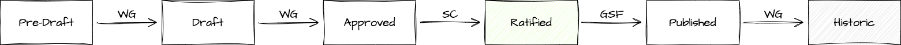

# Project Lifecycle

The term "project" within Green Software Foundation refers to a collaborative endeavor to deliver a work item. There are two types of projects at the Green Software Foundation:  Document Projects and Software Projects. Document Projects are consensus-based. They produce a document, such as a requirements or use cases document, a whitepaper, or analysis. Software projects are maintainer-based. They develop a new capability, refactor, or remove an existing capability for the Green Software Foundation technology releases. Such projects may take the form of a new component (e.g. a new repository) or may propose additions, deletions, or changes to an existing repository or repositories.

**All projects must comply with their Working Group charter.** 

### The Software Project Lifecycle Process 
 

  

 Projects are in one of five possible lifecycle stages:

- [Proposal](#proposal)
- [Incubation](#incubation)
- [Graduated](#graduated)
- [Maintained](#maintained)
- [Archived](#archived)

Software Projects may not necessarily move through those stages in a linear way, although the goal for a Software Project is to Graduate. 

# Proposal
#### Description 
Any GSF Member may raise a project proposal idea. 

#### Expectation
The proposal should be submitted to a Working Group using the [New Project Proposal issue template](https://github.com/Green-Software-Foundation/oc/issues/new?assignees=tmcclell%2C+Sealjay%2C+seanmcilroy29&labels=project%2C+proposed&projects=&template=new-project-proposal.md&title=%5BProject%5D+Title+Of+Project). 

A Proposal must:
-   Have a clear description
-   Have a well-defined scope
-   Identify committed development resources
-   Identify initial maintainers
-   Be vendor neutral
-   Have identified any risks
-   Describe what success looks like
-   Know its audience/community

#### Acceptance Criteria
No barriers to entry - any project idea can be proposed to a Working Group. 

# Incubation
#### Description 
The project is in it’s experimental stage, and is being explored by the project team.  

#### Expectation
Every incubation project must have this disclaimer clearly at the top of their repo README and as a banner on every page of any public-facing documentation

_[!important] Incubation Project
This project is an incubation project being run inside the Green Software Foundation; as such, we *DON’T recommend using it in any critical use case. Incubation projects are experimental, offer no support guarantee, have minimal governance and process, and may be retired at any moment. This project may one day graduate, in which case this disclaimer will be removed._

#### Benefit
- Project home fostering collaborative, open development with a path to maturity via the graduation process
- Project receives marketing support from GSF, including being listed on the GSF website, opportunity to participate in GSF events, social media 
- Project will receive mentorship in areas such as, but not limited to, project management, governance, legal, tooling, security best practices and documentation 

#### Acceptance Criteria
The proposed project must meet the following requirements to reach Incubation: 
- Have a representative of at least one GSF member company participating, who is a WG attendee who will champion the project, volunteer to run it as project lead and share updates at the WG
- Have an assigned GSF PM
- Project name should not be trademarked and should have the approval of GSF marketing
- Similar or competitive projects are allowed. Projects are not excluded for reasons of overlap

#### Lifecycle Stage Approval Process
- Projects seeking to reach Incubation Stage must submit the proposal template issue to the Working Group for consensus approval 
- Once WG approval is gained, the GSF PM must submit an issue to the Oversight Committee repo for awareness. They have 2 weeks to comment / object 
- Project proposals which are deemed by the WG/OC to be of high risk, for example potential reputation damage, financial risk, litigation risk, greenwashing concern, must also be reviewed by the Steering Committee

#### Approving Body
Working Group 

# Graduated
#### Description 
The project is considered mature and stable, and is supported by an active community.  

#### Expectation
- At least version 1 of the project is released and publicly available 
- Contributors may continue to explore further versions of the project 

Every project in Graduated Stage must have this disclaimer clearly at the top of their repo README and as a banner on every page of any public-facing documentation 

_[!important] Graduated Project
This project is a Graduated Project, supported by the Green Software Foundation. The publicly available version documented in the README is trusted by the GSF. New versions of the project may be released, or it may move to the Maintained or Retired Stage at any moment._ 

#### Benefit
- Incubation disclaimer is removed and replace with a banner to show it is a trusted project supported by the GSF 
- Project receives marketing support to celebrate the graduation of the project

#### Acceptance Criteria
The project must meet the Incubation requirements as well as the following:
- Have a active set of contributing members from at least two member organisations
- Have a public GitHub repo with clear project documentation on
  > Project overview (ReadMe)
  
  > How to contribute (contributing.md )
   
  > End User Guide (enablement.md)
  
  >  Test coverage
  
  > Fit within GSF Theory of Change
- Have made a release deployment, even a ‘developer preview’
- Evidence of usefulness through real world use cases in the production environment, including testimonials (adopters.md)
- Have 100% of the applicable criteria for the Open SSF Best Practice Badge (security.md)
- Have an incident process agreed with GSF PM
- Have GSF processes set up including
  
  > Project meetings and mailing list
  
  > Provide regular updates to the relevant WG
  
  > Have defined OKRs agreed by the GSF PM
- Similar or competitive projects are allowed, but the project should not contradict with another GSF Graduated project 

#### Lifecycle Stage Approval Process
- Projects seeking to reach Graduated Stage must submit an issue to the Oversight Committee repo
  GSF PM (and Project Leads) should join the next Oversight Committee meeting to showcase their project meets acceptance criteria below for Graduation consensus approval   
- Once OC approval is gained, the GSF PM must submit an issue to the Steering Committee repo for awareness. They have 2 weeks to comment / object

#### Approving Body
Oversight Committee

# Maintained
#### Description 
The project is considered Graduated but new versions aren’t being released, except for bug fix maintenance. 

#### Expectation
- Projects must be maintained by their community 
- The repo is still open for contributions
- If contributors want to reactivate the project, it can re-enter Incubation Stage
- If maintainers want to stop maintaining the released version, it should progress to the Archived stage 

Every project in Maintained Stage must have this disclaimer clearly at the top of their repo README and as a banner on every page of any public-facing documentation 

_[!important] Maintained Project
This project is in maintenance being run inside the Green Software Foundation.  Releases are maintained but not improved. This project may be retired, or reactivated back into incubation._

#### Benefit
Project remains under the GSF umbrella

#### Acceptance Criteria
The Project Team must notify the GSF PM they are no longer actively working on the project, but will continue maintenance. 

#### Lifecycle Stage Approval Process
Projects seeking to reach Maintained Stage must submit an issue to the Oversight Committee repo, and reach a consensus for approval. 

#### Approving Body
Oversight Committee

# Archived
#### Description 
The project is considered dormant and any releases are no longer being maintained.  

#### Expectation
- Projects are not maintained by their community. 
- If contributors want to restart the project, they must raise a New Project Proposal issue. 

 Every project in Archived Stage must have this disclaimer clearly at the top of their repo README and as a banner on every page of any public-facing documentation.

_[!important] Archived Project
This project is archived and is no longer being run inside the Green Software Foundation. Releases are *NOT maintained or improved. This project cannot be reactivated._ 

#### Benefit
No longer a GSF project

#### Acceptance Criteria
The Project Team must notify the GSF PM they can no longer commit to maintaining the project. 

#### Lifecycle Stage Approval Process
Projects seeking to reach Archived Stage must submit an issue to the Oversight Committee repo, and reach a consensus for approval.
  
#### Approving Body
Oversight Committee

### The Document Project Lifecycle Process 
 

  

 Projects are in one of six possible lifecycle stages:

- [Pre-Draft](#pre-draft)
- [Draft](#draft)
- [Approved](#approved)
- [Ratified](#ratified)
- [Published](#published)
- [Historic](#historic)

Document Projects move through those stages in a linear way, and the goal for a Document Project is to be Published. 

# Pre-Draft
#### Description 
Any GSF Member may submit a  document as a candidate for a Draft

#### Expectation
The proposal should be submitted to a Working Group using the [New Project Proposal issue template](https://github.com/Green-Software-Foundation/oc/issues/new?assignees=tmcclell%2C+Sealjay%2C+seanmcilroy29&labels=project%2C+proposed&projects=&template=new-project-proposal.md&title=%5BProject%5D+Title+Of+Project). 

A Proposal must:
-   Have a clear description
-   Have a well-defined scope
-   Identify committed resources
-   Identify initial maintainers
-   Be vendor neutral
-   Have identified any risks
-   Describe what success looks like
-   Know its audience/community

#### Acceptance Criteria
Low barriers to entry - any Document idea can be proposed to a Working Group. The project should not overlap with any existing standards or specifications. 

# Draft
#### Description 
The project is in it’s experimental stage, and is being explored by the project team.  

#### Expectation
Drafts are critical to any project, serving as the starting point for all future work. 
A publicly accessible repository is available, and the landing page directs users to the Dev feature branch. 
To ensure transparency and compliance, every draft document must contain a clear disclaimer at the top of its README file, as well as a banner on every page of any public-facing documentation.

_[!important] Draft Project
This is a draft document only and has not been approved or adopted by the Green Software Foundation. This draft may not be relied upon for any purpose other than review of the current state of development._

#### Benefit
- Considered an official GSF project and gets the resources required to develop further.
- Project receives marketing support from GSF, including being listed on the GSF website, opportunity to participate in GSF events, social media.
- Project will receive mentorship in areas such as, but not limited to, project management, governance, legal, tooling, security best practices and documentation.
- Opportunity to influence and shape a GSF project deliverables.

#### Acceptance Criteria
The proposed project must meet the following requirements to reach Draft: 
- To ensure effective participation, the project should have at least three representatives from different member companies of the GSF. These representatives should attend the working group and champion the project, volunteer to lead it, and provide regular updates to the group. This will help ensure that the project runs smoothly and progresses towards its goals.
Note: If a Standard specification is looking to be submitted to ISO, the member participation requirement will need to be assessed.
- Have an assigned GSF PM
- Project name will not be trademarked and should have the approval of GSF marketing.

#### Lifecycle Stage Approval Process
- Projects seeking to reach Draft Stage must submit the proposal template issue to the Working Group for consensus approval.
- Once WG approval is gained, the GSF PM must submit an issue to the Oversight Committee repo for awareness. They have 2 weeks to comment / object.
- Project proposals which are deemed by the WG/OC to be of high risk, for example potential reputation damage, financial risk, litigation risk, greenwashing concern, must also be reviewed by the Steering Committee and the Executive Director. 

#### Approving Body
Working Group 

# Approved
#### Description 
Parent Working Group deems the project to have met the objectives as defined in the scope, and have approved the document.  

#### Expectation
A versioned deliverable exists.
Clear reference to the licence under which the Document is being made available [See GSF Charter](https://github.com/Green-Software-Foundation/charter?tab=readme-ov-file).
Note: Before the Working Group approves any Charter changes, there will be a Review and Approval period where all Org leads will be invited to submit comments.

#### Acceptance Criteria
The project must meet the Pre-Draft requirements as well as the following:
- Met it’s scope
- Have a active set of contributing members from at least three member organisations.
- Have a public GitHub repo with clear project documentation on
  > Project overview
  
  > How to contribute
- End-user documentation
- Have GSF processes set up including
  > Project team mailing list
  
  > Provide regular updates to the relevant WG
  
  > Have defined OKRs agreed by the GSF PM
 
#### Lifecycle Stage Approval Process
- [Consistency Review](https://greensoftwarefoundation.atlassian.net/wiki/spaces/~612dd45e45cd76006a84071a/pages/72974348/GSF+Project+Handbook#Consistency-Review-Phase) - The Document is formally reviewed by the project team. A Review period is open for members to submit their comments. After this period, the team will address the issues received.
- WG Review & Approval -  Document reviewed and Approved by the parent Working Group. The approval process is based on consensus, which means that if no comments are submitted, the submission will be approved. However, if comments are submitted, they must be discussed and resolved with the agreement of the Working Group before the submission can be approved.

#### Approving Body
Working Group

# Ratified
#### Description 
GSF Steering Committee Ratifies the Document.  This step triggers the publication process. 

#### Expectation
Legally required as it bounds the GSF Member Organisations to the legal framework defined in the GSF Bylaws [See GSF Charter](https://github.com/Green-Software-Foundation/charter?tab=readme-ov-file)

Every project in Ratified Stage must have this disclaimer clearly at the top of their repo README and as a banner on every page of any public-facing documentation 

_[!important] Ratified Project
This project is a Ratified Document Project, supported by the Green Software Foundation. The publicly available version documented in the README is trusted by the GSF. It may move to the Historic Stage at any moment._ 

#### Benefit
- Document can be published by the GSF
- Has the backing of the GSF’s  Steering Committee
- Formal announcement of ratification to GSF members
- Marketing support to celebrate the ratification of the document
- Draft disclaimer is removed and replace with a banner to show it is a trusted project supported by the GSF

#### Acceptance Criteria
Document approved by the Working Group and passed a Consistency Review & Approval

#### Lifecycle Stage Approval Process
- Project Leads present the Document to the Steering Committee for ratification
- Steering Committee passes the ratification motion 

#### Approving Body
Steering Committee

# Published
#### Description 
After the Steering Committee Ratification the Document can be made publicly available. 

#### Expectation
- Project agree to approve the project. Submitted to the Steering Committee for Ratification.
- Once Ratified, the WG Merges Dev branch into Main. 
- Collaborate with the GSF Communications team to publish and promote the Document
- Gather [public feedback](https://github.com/Green-Software-Foundation/standards-wg/blob/1b8de523cfd1c6242145f3b4dd5083c82a02a6d4/your_guide_to_collaborate_in_a_wg.md#public-feedback)

#### Benefit
Support of the GSF Communications team

#### Acceptance Criteria
Steering Committee agree to ratify the project 

#### Lifecycle Stage Approval Process
Project is ratified by the GSF Steering Committee 
  
#### Approving Body
Steering Committee

# Historic
#### Description 
Document is no longer relevant as the technology it’s defining becomes obsolete or no longer actively maintained.

#### Expectation
- Project repository archived and all branches except for Main removed.
- Not possible to reverse Historic status. Must submit a new proposal and make a reference to it.

Project must have a disclaimer clearly at the top of their README and as a banner on every page of any public-facing documentation

_[!important] Historic Document Project
This project is historic and is no longer being run inside the Green Software Foundation. Documents are *NOT maintained or improved. This project cannot be reactivated._ 

#### Benefit
Remains publicly accessible in an archived repository and marked as Historic

#### Acceptance Criteria
The Project Team must notify the GSF PM. 

#### Lifecycle Stage Approval Process
Request by Project Lead or Project Manager for Working Group to move to Historic status.
  
#### Approving Body
Working Group & Steering Committee
